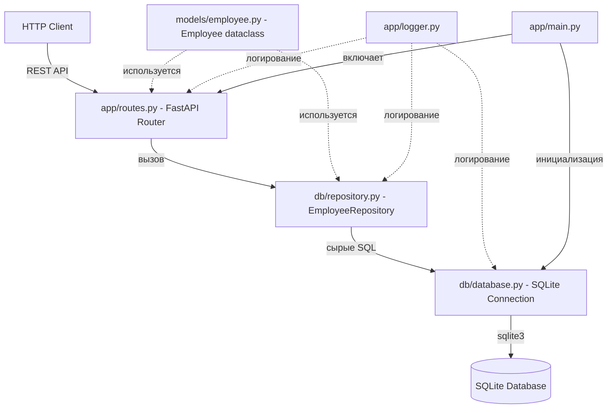
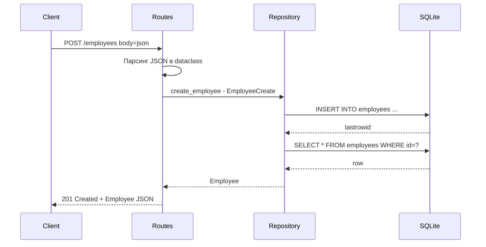

# Архитектура StaffServerKaspersky

## Обзор

REST API приложение для управления сотрудниками. Стек: Python 3.10, FastAPI, SQLite, pytest. Без Pydantic и SQLAlchemy — используются dataclasses и сырые SQL-запросы.

---

## Структура проекта

```
StaffServerKaspersky/
├── app/                         # Серверная часть (FastAPI)
│   ├── __init__.py
│   ├── main.py                  # Точка входа FastAPI приложения
│   ├── routes.py                # Роуты REST API
│   └── logger.py                # Настройка логирования
├── models/                      # Модели данных (dataclasses)
│   ├── __init__.py
│   └── employee.py              # Dataclass Employee, EmployeeCreate, EmployeeUpdate
├── db/                          # Слой работы с базой данных
│   ├── __init__.py
│   ├── database.py              # Подключение к SQLite, инициализация таблиц
│   └── repository.py            # CRUD операции (сырые SQL запросы)
├── tests/
│   ├── __init__.py
│   ├── conftest.py              # Фикстуры pytest (тестовая БД, клиент)
│   └── test_api.py              # Тесты всех эндпоинтов
├── scripts/
│   └── seed.py                  # Скрипт генерации БД с 500 сотрудниками
├── Dockerfile
├── requirements.txt
├── README.md
└── plans/
    └── architecture.md
```

---

## Диаграмма архитектуры



---

## Модель данных — models/employee.py

### Employee dataclass

```python
from dataclasses import dataclass, asdict
from typing import Optional

@dataclass
class Employee:
    id: int
    name: str
    position: Optional[str] = None
    phone: str = ""
    email: str = ""
    age: int = 0
    sex: str = ""
```

### Схема для создания/обновления — без id

```python
@dataclass
class EmployeeCreate:
    name: str
    phone: str
    email: str
    age: int
    sex: str
    position: Optional[str] = None

@dataclass
class EmployeeUpdate:
    name: Optional[str] = None
    position: Optional[str] = None
    phone: Optional[str] = None
    email: Optional[str] = None
    age: Optional[int] = None
    sex: Optional[str] = None
```

---

## SQL-схема таблицы

```sql
CREATE TABLE IF NOT EXISTS employees (
    id INTEGER PRIMARY KEY AUTOINCREMENT,
    name TEXT NOT NULL,
    position TEXT,
    phone TEXT NOT NULL,
    email TEXT NOT NULL,
    age INTEGER NOT NULL,
    sex TEXT NOT NULL
);
```

---

## API эндпоинты

| Метод  | Путь                | Описание                        | Тело запроса     | Ответ              |
|--------|---------------------|---------------------------------|------------------|--------------------|
| GET    | /employees          | Получить список всех сотрудников | —                | List of Employee   |
| GET    | /employees/{id}     | Получить сотрудника по ID       | —                | Employee           |
| POST   | /employees          | Создать нового сотрудника       | EmployeeCreate   | Employee           |
| PUT    | /employees/{id}     | Обновить сотрудника             | EmployeeUpdate   | Employee           |
| DELETE | /employees/{id}     | Удалить сотрудника              | —                | success message    |

### Коды ответов
- 200 — успешная операция
- 201 — сотрудник создан
- 404 — сотрудник не найден
- 422 — ошибка валидации входных данных

---

## Диаграмма потока запроса



---

## Слой базы данных — db/database.py

- Функция `get_connection()` — возвращает `sqlite3.Connection` с `row_factory = sqlite3.Row`
- Функция `init_db()` — создаёт таблицу employees если не существует
- Функция `get_db()` — генератор для dependency injection в FastAPI
- Путь к БД настраивается через переменную окружения `DATABASE_URL`, по умолчанию `employees.db`

---

## Репозиторий — db/repository.py

Класс `EmployeeRepository` с методами:

- `get_all(conn) -> list[Employee]` — SELECT * FROM employees
- `get_by_id(conn, id) -> Employee | None` — SELECT * WHERE id=?
- `create(conn, data: EmployeeCreate) -> Employee` — INSERT + возврат созданного
- `update(conn, id, data: EmployeeUpdate) -> Employee | None` — UPDATE SET ... WHERE id=?
- `delete(conn, id) -> bool` — DELETE FROM employees WHERE id=?

Все методы — статические функции, принимающие connection как аргумент.

---

## Логирование — app/logger.py

- Используется стандартный модуль `logging`
- Формат: `%(asctime)s - %(name)s - %(levelname)s - %(message)s`
- Уровень: INFO для production, DEBUG для разработки
- Логируются: входящие запросы, операции с БД, ошибки

---

## Тесты — tests/

### conftest.py
- Фикстура `test_db` — создаёт временную SQLite БД в памяти `:memory:`
- Фикстура `client` — `TestClient` из FastAPI с переопределённой зависимостью `get_db`
- Фикстура `sample_employee` — словарь с тестовыми данными сотрудника

### test_api.py
- `test_create_employee` — POST, проверка 201 и полей
- `test_get_employees` — GET список, проверка что возвращается массив
- `test_get_employee_by_id` — GET по id, проверка полей
- `test_get_employee_not_found` — GET несуществующий id, проверка 404
- `test_update_employee` — PUT, проверка обновлённых полей
- `test_update_employee_not_found` — PUT несуществующий id, проверка 404
- `test_delete_employee` — DELETE, проверка успешного удаления
- `test_delete_employee_not_found` — DELETE несуществующий id, проверка 404

---

## Скрипт seed.py

- Использует модуль `faker` для генерации реалистичных данных
- Создаёт БД и таблицу
- Генерирует 500 сотрудников с рандомными данными
- Использует `executemany` для batch-вставки

---

## Dockerfile

```dockerfile
FROM python:3.10-slim

WORKDIR /app

COPY requirements.txt .
RUN pip install --no-cache-dir -r requirements.txt

COPY . .

RUN python scripts/seed.py

EXPOSE 8000

CMD ["uvicorn", "app.main:app", "--host", "0.0.0.0", "--port", "8000"]
```

---

## requirements.txt

```
fastapi==0.104.1
uvicorn==0.24.0
pytest==7.4.3
httpx==0.25.2
faker==20.1.0
```

> `httpx` нужен для `TestClient` в FastAPI.

---

## Ключевые решения

1. **Без Pydantic** — входные данные парсятся вручную из `Request.json()`, валидация через проверки в роутах
2. **Без SQLAlchemy** — все SQL запросы пишутся вручную через `sqlite3`
3. **Dataclasses** — используются для типизации и сериализации через `dataclasses.asdict()`
4. **Dependency Injection** — `get_db()` как FastAPI dependency для передачи connection в роуты
5. **Тестовая изоляция** — тесты используют in-memory SQLite БД
